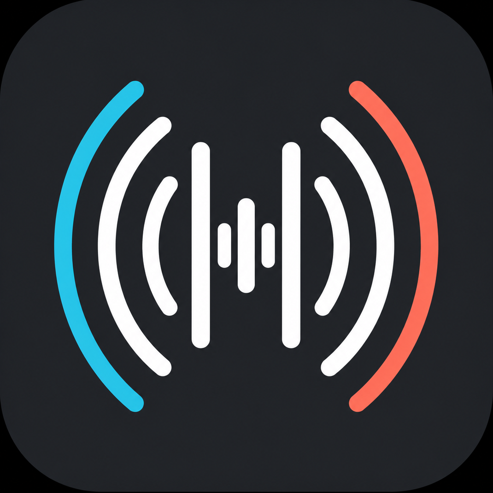

# RoomDeck Audio

[](https://github.com/c-archer/homewave/actions/workflows/ci.yml)



RoomDeck Audio is an independent, native Apple Silicon macOS controller compatible with Sonos systems. It provides account favorites, room and group controls, current playback, artwork, volume, transport controls, and macOS media-key support.

RoomDeck Audio is not affiliated with, endorsed by, or sponsored by Sonos, Inc. Sonos is a trademark of Sonos, Inc.

> [!IMPORTANT]
> This beta controls physical audio equipment. The public source uses the documented Sonos Control API only. Review [Legal](LEGAL.md), [Privacy](PRIVACY.md), and [Security](SECURITY.md) before operating or distributing it.

## Features

- Sonos account authorization before controls are shown
- Rooms, groups, current playback, service metadata, and artwork
- Create, edit, and split speaker groups
- Play, pause, previous, next, volume, and macOS media-key controls
- Play items saved in Sonos Favorites
- OAuth tokens stored in the current user's macOS Keychain

Direct music-service catalogue search is intentionally not included. Sonos does not document a general third-party catalogue API for this integration, and the project does not ship reverse-engineered private interfaces.

## Requirements

- Apple Silicon Mac running macOS 14 or later
- An online Sonos system associated with the signed-in account
- A Sonos Control API integration
- A deployed copy of the included authentication Worker
- Xcode with Swift 6 and Node.js 20 or later for development

## Install A Release

Download the Apple Silicon ZIP and matching SHA-256 file from GitHub Releases, then verify it:

```sh
shasum -a 256 -c "RoomDeck-Audio-0.1.0-arm64.zip.sha256"
```

Official releases should be Developer ID signed and notarized. Do not bypass a macOS warning for a build you do not trust.

## Run From Source

```sh
git clone https://github.com/c-archer/homewave.git
cd homewave
ROOMDECK_SONOS_AUTH_BASE_URL=https://auth.example.com swift run RoomDeckAudio
```

## Configure Sign-In

1. Create and activate a Sonos Control API integration.
2. Deploy [`Workers/roomdeck-audio-auth`](Workers/roomdeck-audio-auth) to your Cloudflare account.
3. Configure its KV binding, Sonos Client ID, encrypted Client Secret, exact HTTPS redirect URI, and `APP_CALLBACK_URL=roomdeck-audio://sonos-auth`.
4. Register the Worker's HTTPS callback in the Sonos integration.
5. Build with the Worker's HTTPS origin and the deployment's public privacy policy:

```sh
SONOS_AUTH_BASE_URL=https://auth.example.com \
PRIVACY_POLICY_URL=https://example.com/privacy \
./Scripts/build-app.sh
open "dist/RoomDeck Audio.app"
```

The Sonos Client Secret must only exist in the Worker secret store. Never bundle it with the app or commit it to Git.

## Build And Test

```sh
./Scripts/validate.sh
```

The full check formats and tests Swift, tests the Worker, runs legal-release guards, and creates an ad-hoc-signed arm64 app in `dist/RoomDeck Audio.app`.

## Repository Automation

- `CI`: legal guard, formatting, Swift tests, Worker tests, arm64 packaging, plist, signature, and architecture checks
- `CodeQL`: weekly and change-triggered Swift and JavaScript security analysis
- `Release`: tagged arm64 ZIPs, SHA-256 checksums, optional Developer ID signing, and optional notarization
- `Dependabot`: weekly GitHub Actions updates

See [Contributing](CONTRIBUTING.md), [Architecture](docs/ARCHITECTURE.md), [Asset Provenance](docs/ASSET_PROVENANCE.md), and [Releasing](docs/RELEASING.md).

## License

Source code and project-created artwork are available under the [MIT License](LICENSE). The license does not grant rights to third-party names, marks, services, metadata, or artwork.
